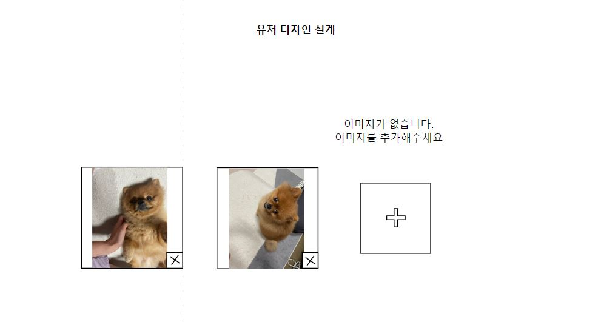
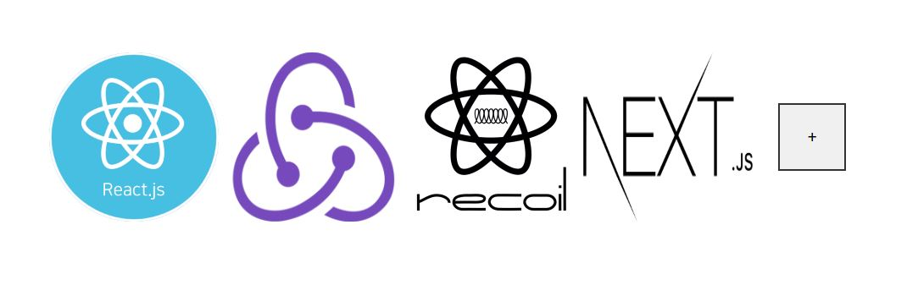

# react-image-gallery

## 기술스택

 <p align="center">
  
  
  
</p>
<br />

## Start

1. img-gallery로 이동합니다.

```sh
cd img-gallery
```

2. start를 합니다.

```sh
$ yarn start
```

## USER FLOW



## Final IMage


